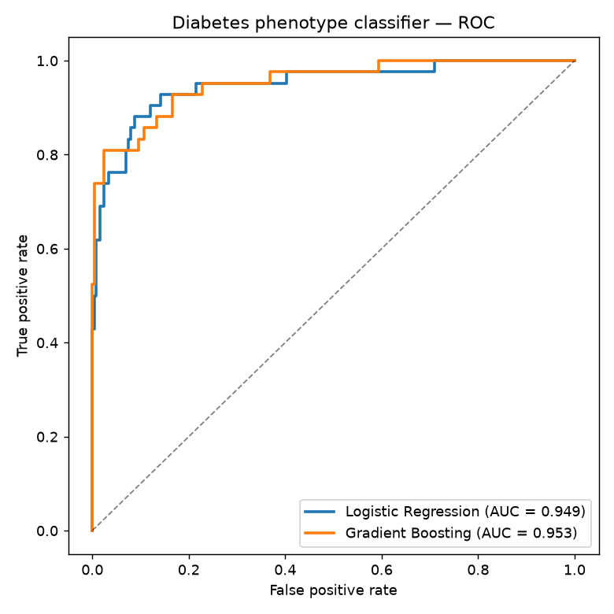
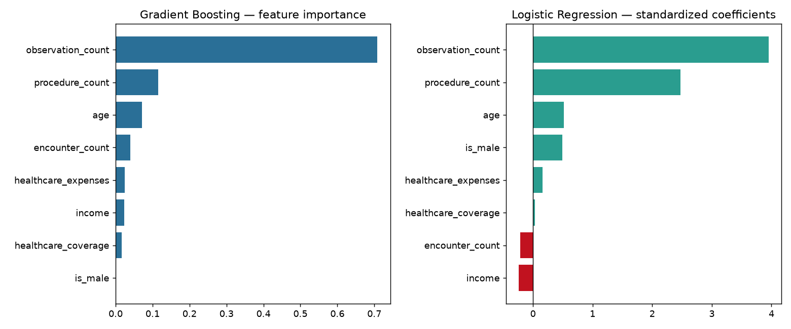
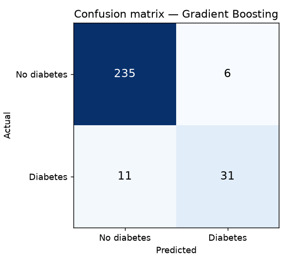
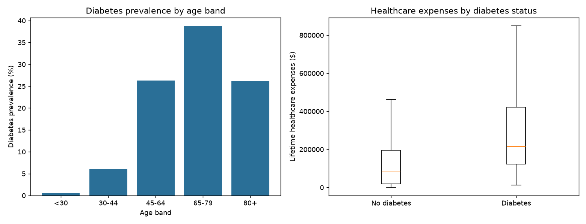

# ML layer — Diabetes phenotype prediction

A downstream machine-learning step on top of the lakehouse: predict whether a patient has
**type-2 diabetes** from demographics and general healthcare-utilization patterns. It's a
*risk-stratification / phenotype-detection* framing — the kind of model a care-management
team uses to surface patients for review — built with a deliberately **leakage-aware**
design.

Runs locally with scikit-learn (no Databricks needed), reproducing the `gold.patient_features`
logic in pandas so the model is fully reproducible by anyone who clones the repo.

```bash
pip install -r ml/requirements.txt
python ml/build_features.py        # Synthea CSV → ml/patient_features.csv
python ml/train_diabetes_model.py  # → ml/metrics.json + ml/figures/
```

## The design decisions (this is the point)

A model is only as honest as its feature/target setup. Three deliberate choices:

1. **Target excludes prediabetes.** Synthea labels prediabetes as *"Prediabetes (finding)"*,
   and a naive `description.contains("diabetes")` would wrongly fold it into the positive
   class (*"prediabetes"* contains the substring *"diabetes"*). The target is type-2 diabetes
   mellitus **and its complications** (retinopathy, neuropathy, nephropathy), with prediabetes
   held out. Prevalence: **15.0%** (169 / 1,129) — realistic for US type-2 rates.

2. **No-leakage feature selection.** Features are demographics + *general* utilization:
   `age, is_male, income, healthcare_expenses, healthcare_coverage, encounter_count,
   procedure_count, observation_count`. Deliberately **excluded**:
   - *condition counts* — would contain the diabetes diagnosis itself (direct label leakage);
   - *medication count* — too tightly coupled to diabetes treatment (insulin/metformin), so
     it would be circular rather than predictive;
   - *race / ethnicity* — protected attributes, excluded from the model by the project's
     de-identification stance (consistent with `gold.patient_features`).

3. **Two models, reported honestly** — an interpretable logistic-regression baseline and a
   gradient-boosting model, with 5-fold cross-validation *and* a held-out test set.

## Results

| Model | CV AUC | Test AUC | Accuracy | Precision | Recall | F1 |
|-------|:------:|:--------:|:--------:|:---------:|:------:|:--:|
| Logistic Regression | 0.946 ± 0.012 | 0.949 | 0.905 | 0.627 | **0.881** | 0.733 |
| Gradient Boosting | 0.960 ± 0.013 | **0.953** | **0.940** | **0.838** | 0.738 | **0.785** |

Held-out test set = 283 patients. The two models trade off the way you'd expect: the LR
baseline catches more true diabetics (**recall 0.88** — useful for screening), while GB is
more precise and accurate (fewer false alarms). Which you'd ship depends on whether a missed
case or a false flag is costlier — a real care-management decision, not a leaderboard number.



## What the model is actually learning



`observation_count` dominates both models — and that's interpretable, not magic: diabetics
receive **frequent lab monitoring** (glucose, HbA1c, lipid panels, kidney function), so their
observation footprint is large. The model is largely detecting the *monitoring signature* of
diabetes care. `age` and male sex add epidemiologically-correct signal (both push risk up).
Being able to explain *why* a 0.95-AUC model works — rather than just reporting the number —
is the difference between a model you can defend and one you can't.




Prevalence rises sharply with age (peaking at ~39% in the 65–79 band, near-zero under 30),
and diabetic patients carry ~2.5× the median lifetime healthcare cost — both clinically
realistic patterns that the de-identified feature table preserves.

## Caveats

- **Synthetic data.** Performance reflects Synthea's generative model, not real clinical
  predictability. This demonstrates the *engineering and modeling discipline*, not a
  deployable diagnostic.
- **Utilization as a proxy.** High AUC is driven by the fact that diabetes care leaves a
  heavy utilization/monitoring trail. That's a legitimate signal for *flagging* patients in
  existing data, but it's detection-by-footprint, not early prediction of undiagnosed disease.
- **Offline mirror.** `build_features.py` reproduces the gold feature logic in pandas for
  reproducibility; the canonical transformation lives in the Databricks
  [pipeline notebook](../notebooks/clinical_lakehouse_pipeline.ipynb).
